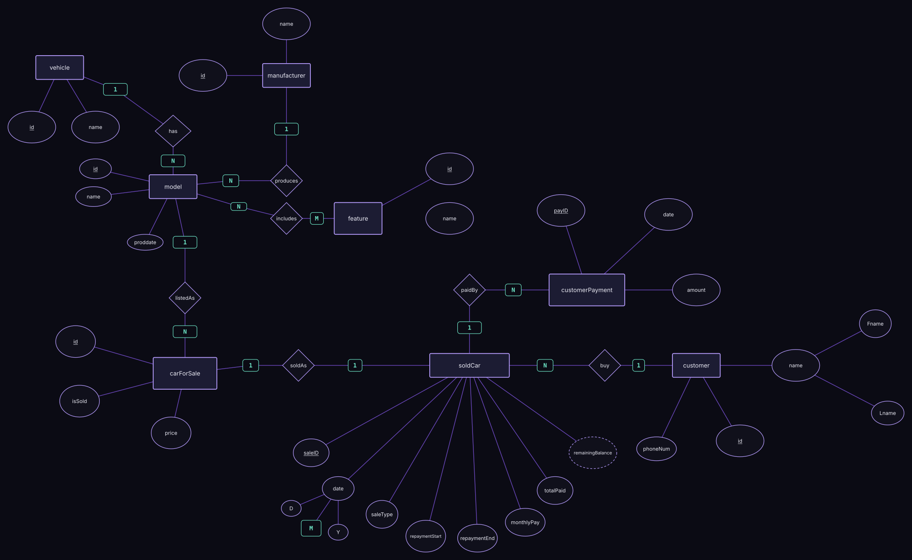

# Car Company Database and ERD

An Entity Relationship Diagram (ERD) for a car company system, and the SQL Server database built from it. It covers the full path of a car, from the manufacturer that produces a model, to the car listed for sale, to the sale itself and the customer's payments.

## ERD

The diagram uses Chen notation. Open `erd.svg` directly to zoom in, or edit the original in `Car_Company_ERD.drawio` at [app.diagrams.net](https://app.diagrams.net).

## Entities

| Entity | Attributes |
|---|---|
| `vehicle` | `id`, `name` |
| `manufacturer` | `id`, `name` |
| `model` | `id`, `name`, `proddate` |
| `feature` | `id` |
| `carForSale` | `id`, `price`, `isSold` |
| `soldCar` | `saleID`, `date`, `saleType`, `repaymentStart`, `repaymentEnd`, `monthlyPay`, `totalPaid`, `remainingBalance` |
| `customer` | `id`, `name`, `phoneNum` |
| `customerPayment` | `payID`, `date`, `amount` |

## Relationships

| Relationship | Entities | Cardinality |
|---|---|---|
| `has` | vehicle → model | 1 : N |
| `produces` | manufacturer → model | 1 : N |
| `includes` | model ↔ feature | N : M |
| `listedAs` | model → carForSale | 1 : N |
| `soldAs` | carForSale → soldCar | 1 : 1 |
| `buy` | customer → soldCar | 1 : N |
| `paidBy` | soldCar → customerPayment | 1 : N |

## How to read it

1. A **vehicle** type has many **models**, and each model is produced by one **manufacturer**.
2. A model can include many **features**, and a feature can appear in many models.
3. Each model can be listed as many **cars for sale**, each with its own price and sold status.
4. When a car is sold, a **soldCar** record stores the sale type, repayment period, monthly payment, total paid, and remaining balance.
5. A **customer** can buy many cars, and each sale can have many **customer payments**.

## Concepts practiced

Entity-relationship modeling, turning an ERD into tables, one-to-many, one-to-one and many-to-many relationships, junction tables, `CHECK` constraints, and `JOIN` queries.

## SQL implementation

`CarCompanyDB.sql` turns the ERD into a SQL Server database with sample data and example queries.

| ERD | Table | How it is implemented |
|---|---|---|
| `vehicle` | `Vehicles` | Primary key `VehicleID` |
| `manufacturer` | `Manufacturers` | Primary key `ManufacturerID` |
| `model` | `Models` | Foreign keys `VehicleID` (`has`) and `ManufacturerID` (`produces`) |
| `feature` | `Features` | Primary key `FeatureID`, plus a `FeatureName` column added to the ERD's `id` |
| `includes` (N : M) | `ModelFeatures` | Junction table with a composite primary key |
| `carForSale` | `CarsForSale` | Foreign key `ModelID` (`listedAs`) |
| `soldCar` | `SoldCars` | `CarID` is `UNIQUE` (`soldAs`, 1 : 1) and `CustomerID` is a foreign key (`buy`) |
| `customer` | `Customers` | Primary key `CustomerID` |
| `customerPayment` | `CustomerPayments` | Foreign key `SaleID` (`paidBy`) |

Extra rules in the script:

- `SaleType` must be `Cash` or `Installment`, and an installment sale needs a repayment start, end, and monthly payment.
- Prices and payment amounts must be greater than zero.

### How to run

1. Open `CarCompanyDB.sql` in SQL Server Management Studio or Azure Data Studio.
2. Run the whole script. It creates `CarCompanyDB`, the tables, the sample data, and six example queries.

## Author

**Youssif Elhadad**, Computer and Information Science student at Mansoura University, aspiring Data Engineer.
[LinkedIn](https://www.linkedin.com/in/youssif-nasser-elhadad/) · [GitHub](https://github.com/JoeElhadad0) · youssifelhadad@gmail.com
